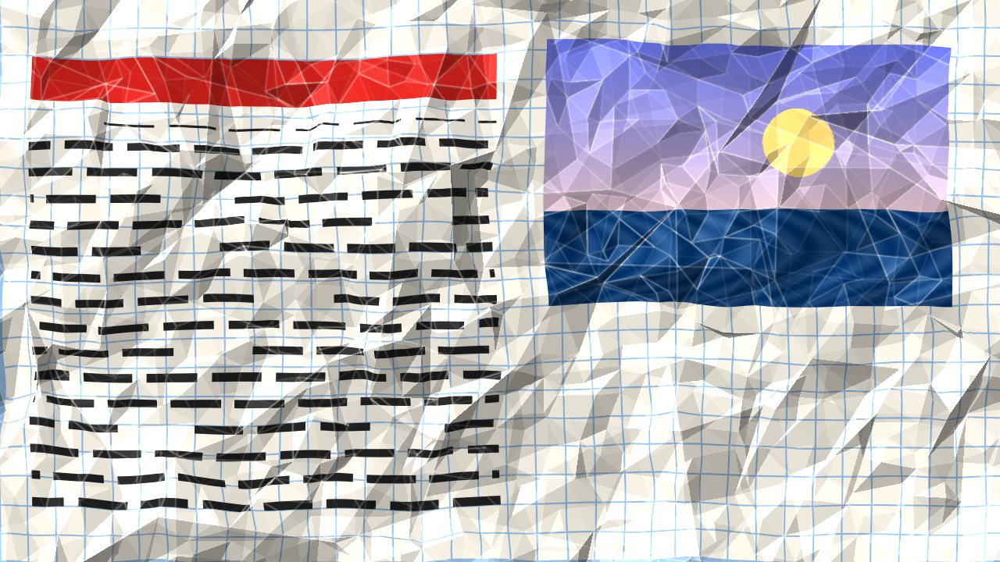
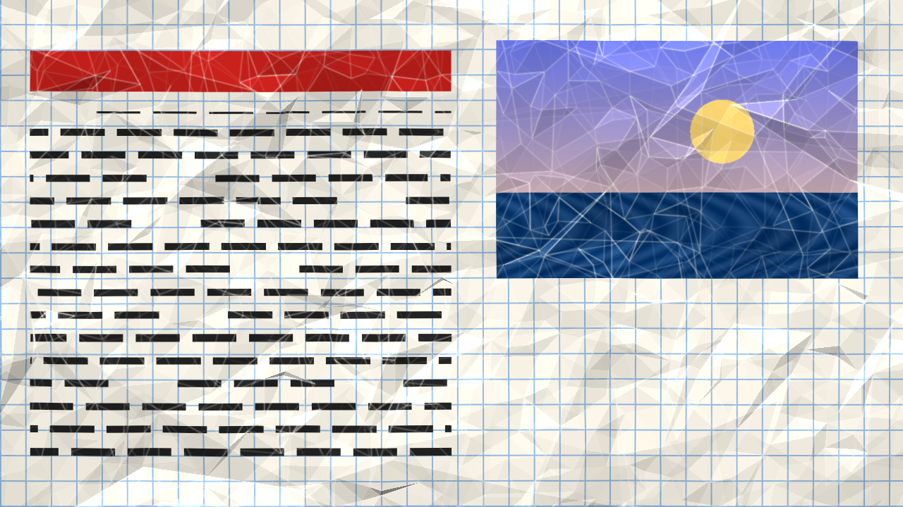

# crumple

> **AI-assisted project.** This codebase was created with [Claude](https://claude.com/claude-code)
> (Anthropic), directed and reviewed by a human author. It has **never been
> loaded into Resolume**. Everything below is measured by an offline harness
> that drives the real plugin class in a headless GL context. `crtest
> --isometry` checks the central claim, that paper bends but does not stretch:
> across a straight ridge of slope s the print must pull in by exactly ½s² of
> the ridge's width, and it does, at every Detail. `--lambert` checks each
> facet's shading against the formula, and `--shadow` checks a ridge's shadow
> against H/tan e. `--flat` requires Crumple 0 to be the identity.
> `--monotone` requires crumpling only ever to raise the sheet, and the facets
> to tile the frame. `crtest --negative` re-runs every check against a
> deliberately wrong model and fails if any of them *passes*. A control sweep
> fails if any parameter does nothing.

Crumpled paper for Resolume Arena/Avenue, as an FFGL effect. The clip is
printed on a sheet that is crumpled, then smoothed out again, under a desk
lamp.

The harness's own card (a ruled grid, a headline, lines of text, a
photograph) at the plugin's defaults. Rendered by the plugin's offline harness
(`crtest`), not captured from Resolume.

## The one idea

**Paper bends but does not stretch.** Crumpled paper is facets and creases:
each facet is nearly flat, because a sheet can curve one way without
stretching but not two, and the facets meet along straight creases. The sheet
here is exactly that. Crease junctions are scattered, joined by a Delaunay
triangulation and given heights, so every triangle is a flat facet and every
edge a straight crease. There are up to four generations of it, each 0.45
times finer and arriving later, the way a hand crumples: big folds first,
then smaller ones inside them.

Where the sheet tilts, the print on it has to come from somewhere. The ink
does not stretch with the paper; it is pulled in. The in-plane displacement
that keeps the sheet unstretched to second order in slope (Föppl–von Kármán:
sym∇u + ½∇h⊗∇h = 0) is solved in least squares, one Fourier mode at a time,
and the print is read from where the sheet pulled it.

What falls out of that, rather than being drawn:

- **The print kinks at every crease.** A straight line crossing a crease
  bends there, because the facets either side pull it in by different
  amounts. A texture overlay cannot do this; it is the tell of real crumpled
  paper.
- **Facet-by-facet light.** Each facet takes the lamp at its own angle.
  Lambert is normalised to the flat sheet, so a flat sheet is exactly the
  picture.
- **Shadows** from the ridges at a low lamp.
- **The marks stay when it is smoothed out.** Flatten lowers every facet, but
  the fibres broken along each crease were measured on the sheet as crumpled,
  so a flattened sheet still shows them.

Flatten 0.8, the lamp swung round. Rendered by `crtest`.

## Controls

- **Sheet:**
  - **Crumple:** how far through the crumpling, 0 to 1. Animate it.
  - **Flatten:** how far it has been smoothed back out.
  - **Scale:** the first generation's facet size, as a fraction of the frame.
  - **Layers:** one to four generations.
  - **Relief:** a multiplier on every slope.
  - **Seed:** which sheet.
  - **Stretch:** 1 is physical; 0 leaves the print where it was printed.
  - **Detail:** the stretch solve's grid.
- **Lamp:** Lamp Elevation, Lamp Azimuth, Ambient, Shadows, Sheen, Wear (the
  crease marks) and Paper (the colour they show).
- **Audio:** Audio (Resolume's FFT buffer) and Audio Scrunch. The level, and
  harder on a kick, adds to Crumple, so the sheet scrunches to the music.
- **Output:** View (*Picture*, or the *Height*, *Normals* or *Stretch* on its
  own) and Mix.

Every length is a fraction of the frame height, so the same settings crumple
the same sheet at any raster.

## Status

**v0.1.0, 2026-09-23, and honestly early.**

It has **never been loaded into Resolume**. `oxbow probe` reads the bundle as
`SW Crumple` / `CR01` / effect, and `oxbow selftest` instantiates it through
the host's own path. Nothing else has run it. There is no OpenFX port, no
browser demo and no factory presets. It has only been built and measured on
macOS (Apple Silicon, M4 Max); a Windows build ships from CI and nothing has
run it.

What is measured, on this machine:

| | |
| --- | --- |
| isometry | a straight ridge of slope 0.5 pulls the print in by **0.03000**, against ½s²·2W = 0.03000. Worst error 8e-5 at Detail 512, 1.1e-4 at 1024, 3.9e-4 at 256 (one coarse pixel of facet edge). No sideways stretch (1e-9) |
| the print | is read from x − u, to **4.5e-6** across a row |
| Lambert | the two facets of a known ridge, at two rasters, to **1e-7** |
| shadow | a ridge 0.08 high under a 20° lamp ends its shadow at **0.7824** (1080p), against H/tan e = 0.7802; the bound is the march step's worth, 0.0064 |
| identity | Crumple 0: the output is the picture **exactly**, at two rasters |
| monotone | 2,550 junctions and 5,032 facets, the same bit for bit from the same seed. No corner ever sinks as Crumple rises, and every facet tiles the frame |
| negative controls | **5** deliberately wrong models, **all 5** detected |
| dead controls | **20** parameters, all live |

Render cost (`crtest --bench`, four generations): a still sheet is built once,
and each later frame is the composite alone, **0.1–0.3 ms** from 720p to 4K. A
moving sheet (Crumple automated) is rebuilt every frame: **2.3 ms at 720p,
2.5 at 1080p, 2.9 at 4K**.

What is **not** verified, and is the honest limit of this release:

- **Second order in slope.** The isometry is the small-slope one, so at the
  steepest Relief the print is pulled in less than a fully nonlinear sheet
  would pull it. Where facets meet at a junction the sheet cannot be exactly
  unstretched (those are the d-cones of real crumpled paper), and the least
  squares spreads the difference.
- **A heightfield.** The sheet never folds over itself, so there are no
  overlapping layers and nothing hidden behind a fold.
- **A directional lamp, a flat ambient, no bounce light** between facets.
- **The sheet's edges are held to the frame's**, as if taped down; a real
  sheet's edges pull in.

## Build

C++17 + GLSL 4.10, CMake, FFGL 2.1 (SDK vendored as a submodule). macOS builds
are universal (arm64 + x86_64); Windows needs GLEW via vcpkg.

    git clone --recursive https://github.com/stoatworks-labs/crumple
    cmake -B build -DCMAKE_BUILD_TYPE=Release
    cmake --build build
    cmake --install build          # into Resolume's Extra Effects

## Building and testing

    ./build/crtest --out /tmp/frame.png       the card, crumpled
    ./build/crtest --flat                     Crumple 0 is the identity
    ./build/crtest --isometry                 the print pulls in by 1/2 s^2
    ./build/crtest --lambert                  each facet lit by the formula
    ./build/crtest --shadow                   a ridge's shadow is H / tan e long
    ./build/crtest --monotone                 crumpling only raises the sheet
    ./build/crtest --negative                 every check above, against a wrong model
    ./build/crtest --bench                    still and moving, 720p through 4K
    python3 tools/sweep.py                    no control is silently dead
    tools/verify.sh                           all of it, in about fifteen seconds

    ./build/crtest --film 600 --size 1280x720 --script docs/demo.cues \
      | ffmpeg -f rawvideo -pix_fmt rgba -s 1280x720 -r 60 -i - demo.mp4

<!-- attributions:start -->
This project is built on other people's work — see [ATTRIBUTIONS.md](ATTRIBUTIONS.md).
<!-- attributions:end -->

## Licence

MIT.

The sheet is a random triangulated surface (Delaunay, by Bowyer–Watson). The
stretch is the Föppl–von Kármán in-plane strain of plate theory, solved by
least squares. The light is Lambert and Blinn. The Fourier transform is
[millpond](https://github.com/stoatworks-labs/millpond)'s. Nothing is copied
from anyone's source.
